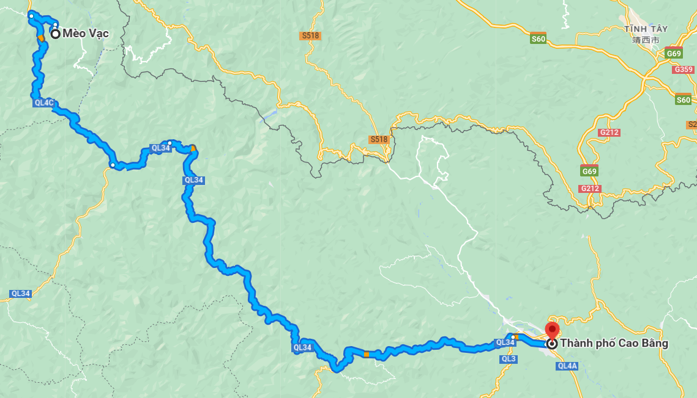

# Ha Giang - Ha Long bike trip

### This trip highlights the best scenaries in the north of Vietnam, from mountains to sea! And it's best suitable for bike/scooter with mountain road and slow speeds. The route could be done in 4-5 days but best to plan 6-8 days to fully explore each stops.

#### Sample trip for the Ha Giang loop: https://www.youtube.com/results?search_query=Motobike+ha+gian+loop

<iframe width="560" height="315" src="https://www.youtube.com/embed/dh6HgYGwlCs?si=wB-P65k042x4Pmtt" title="YouTube video player" frameborder="0" allow="accelerometer; autoplay; clipboard-write; encrypted-media; gyroscope; picture-in-picture; web-share" allowfullscreen></iframe>

## Day 0: Ha Hoi - Ha Giang
* Start in Ha Noi at around 21:00 (9pm)
* Travel by rental car or by sleeper-bus to Ha Giang: 5-hours ride
  * Sleeper bus experience: https://www.youtube.com/watch?v=oJvWdp_opPQ
  * It usually departs at 11pm, and arrive at 4am :)
* We will then rent the motobikes in Ha Giang

### Bike rental
[Full bike list in Ha Giang](https://qtmotorbikesandtours.com.vn/motorbike-rental-ha-giang-cao-bang/)

|  |  |  |

## Day 1: Ha Giang - Quan Ba - Dong Van (160km)
* [Map route](https://www.google.com/maps/dir/Tp.+H%C3%A0+Giang,+H%C3%A0+Giang,+Vi%E1%BB%87t+Nam/Qu%E1%BA%A3n+B%E1%BA%A1,+H%C3%A0+Giang,+Vi%E1%BB%87t+Nam/tt.+%C4%90%E1%BB%93ng+V%C4%83n,+%C4%90%E1%BB%93ng+V%C4%83n+District,+Ha+Giang,+Vietnam/@23.0330024,104.9995559,11z/data=!4m20!4m19!1m5!1m1!1s0x36cc79b180b4239d:0xb7a373a73bc23544!2m2!1d104.9784494!2d22.8025588!1m5!1m1!1s0x36cc0b167fa61df7:0x8495bfb0cc033df9!2m2!1d104.9856176!2d23.087186!1m5!1m1!1s0x36cbe6cfb1c33961:0x5eff1d412485f4aa!2m2!1d105.3627336!2d23.2781471!3e0?entry=ttu)
* 5 hours ride
* Stops: 
  * Quan Ba
  * Tham Ma 
  * Lunch at Quán Cơm nhà Pao
  * Bản Lao Sa
  * Bai Da Mat Trang
  * Vườn hoa Tam Giác Mạch
* Sleep in tp Dong Van.  At Aladin Deo Gio https://maps.app.goo.gl/u41zgfS6DYPktHeH9

## Day 2: Dong Van - Ma Pi Leng - Meo Vac (x km)

* [Map route](https://www.google.com/maps/dir/tt.+%C4%90%E1%BB%93ng+V%C4%83n,+%C4%90%E1%BB%93ng+V%C4%83n,+H%C3%A0+Giang,+Vi%E1%BB%87t+Nam/M%E1%BB%8Fm+%C4%90%C3%A1+T%E1%BB%AD+Th%E1%BA%A7n/%C4%90i%E1%BB%83m+D%E1%BB%ABng+Ch%C3%A2n+%C4%90%E1%BB%89nh+%C4%90%C3%A8o+M%C3%A3+P%C3%AD+L%C3%A8ng/S%C3%B4ng+Nho+Qu%E1%BA%BF/X%C3%ADn+C%C3%A1i,+M%C3%A8o+V%E1%BA%A1c,+H%C3%A0+Giang,+Vi%E1%BB%87t+Nam/@23.2230905,105.4129787,14z/data=!4m32!4m31!1m5!1m1!1s0x36cbe6cfb1c33961:0x5eff1d412485f4aa!2m2!1d105.3627336!2d23.2781471!1m5!1m1!1s0x36cbe77966841c53:0xa375f371f2f81f06!2m2!1d105.3973084!2d23.2428988!1m5!1m1!1s0x36cbdd8669d86521:0xd2f3d769da6c16f4!2m2!1d105.4122845!2d23.2399909!1m5!1m1!1s0x36cbddff25c0fad7:0x5f067a2b76784fa5!2m2!1d105.4185541!2d23.241823!1m5!1m1!1s0x36cbdde071165663:0xcded36eca0d45c69!2m2!1d105.4595306!2d23.2205273!3e0?entry=ttu)

* We will not go much south but instead explore local towns in the mountain by dirt roads.
* Stops: 
  * Breakfast banh cuon Ba Ha
  * Coffee Phien 
  * Mom Da Tu Than
  * Skypath Vách Đá Trắng 
  * Lunch at Nho Que
* Sleep in Amazing Meo Vac - Lang hMong

## Day 3: Meo Vac - Cao Bang

* [Map route](https://www.google.com/maps/dir/M%C3%A8o+V%E1%BA%A1c,+H%C3%A0+Giang,+Vi%E1%BB%87t+Nam/Cao+B%E1%BA%B1ng,+Cao+Bang,+Vietnam/@22.8315062,105.4116828,10z/data=!4m14!4m13!1m5!1m1!1s0x36cbc2e68b24fc99:0xa614a6b6491c3d1c!2m2!1d105.4536718!2d23.1341053!1m5!1m1!1s0x36ca643b852c0327:0xf7278f9b5a7c6921!2m2!1d106.2639852!2d22.6666369!3e0?entry=ttu)
* 6 hours ride
* Đèo Mẻ Pia - xe hơi đi được ko?
* Rừng trúc Lũng Pán
* Lunch ?

## Day 4: Cao Bang - Ban Gioc - Nguom Ngao - Phong Nam - Ngoc Con

* [Map route](https://www.google.com/maps/dir/Cao+B%E1%BA%B1ng,+Cao+Bang,+Vietnam/Th%C3%A1c+B%E1%BA%A3n+Gi%E1%BB%91c,+TL+211,+%C4%90%C3%A0m+Thu%E1%BB%B7,+S%C3%B9ng+T%E1%BA%A3,+Cao+B%E1%BA%B1ng,+Vi%E1%BB%87t+Nam/Phong+N%E1%BA%ADm,+Tr%C3%B9ng+Kh%C3%A1nh,+Cao+B%E1%BA%B1ng,+Vi%E1%BB%87t+Nam/Ng%E1%BB%8Dc+C%C3%B4n,+Tr%C3%B9ng+Kh%C3%A1nh,+Cao+B%E1%BA%B1ng,+Vi%E1%BB%87t+Nam/@22.8072176,106.3648747,11.26z/data=!4m26!4m25!1m5!1m1!1s0x36ca643b852c0327:0xf7278f9b5a7c6921!2m2!1d106.2639852!2d22.6666369!1m5!1m1!1s0x36ca643ca72ac71b:0xd00c006bac4a0f37!2m2!1d106.7240986!2d22.8546786!1m5!1m1!1s0x36ca0abbb86f56e7:0xa846c4d0d9ec3962!2m2!1d106.5171626!2d22.8912953!1m5!1m1!1s0x36b5f57aea57de77:0x99b6fe9a8323ef3f!2m2!1d106.5407299!2d22.9119081!3e0?entry=ttu)

* 100km 

## Day 5: Cao Bang - Ha Long
* Ride back to Cao Bang to drop off the bikes
* Use car to travel to Ha Long

## Day 6: Ha Long 
* We will sleep in a cruise ship in Ha Long for 1-2 night

<iframe width="560" height="315" src="https://www.youtube.com/embed/RiELdjiAUdY?si=iDAeA-zANUAyH7md" title="YouTube video player" frameborder="0" allow="accelerometer; autoplay; clipboard-write; encrypted-media; gyroscope; picture-in-picture; web-share" allowfullscreen></iframe>

## Day 7: Ha Long - Ha Noi

