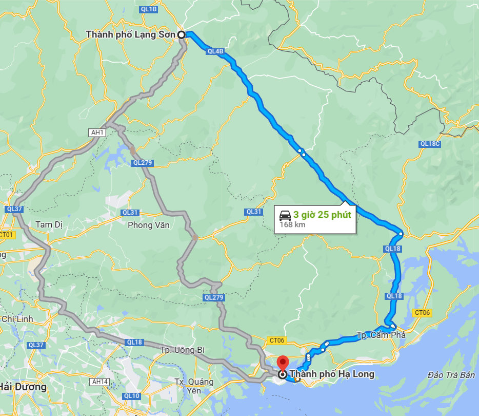

# Ha Giang - Ha Long bike trip

### This trip highlights the best scenaries in the north of Vietnam, from mountains to sea! And it's best suitable for bike/scooter with mountain road and slow speeds. The route could be done in 4-5 days but best to plan 6-8 days to fully explore each stops.

#### Sample trip for the Ha Giang loop: https://www.youtube.com/results?search_query=Motobike+ha+gian+loop
<iframe width="560" height="315" src="https://www.youtube.com/embed/dh6HgYGwlCs?si=wB-P65k042x4Pmtt" title="YouTube video player" frameborder="0" allow="accelerometer; autoplay; clipboard-write; encrypted-media; gyroscope; picture-in-picture; web-share" allowfullscreen></iframe>

## Day 1: Ha Hoi - Ha Giang
* Start in Ha Noi
* Travel by rental car by by sleeper-bus to Ha Giang: 6-hours ride
  * Sleeper bus experience: https://www.youtube.com/watch?v=oJvWdp_opPQ
  * It usually departs at 11pm, and arrive at 4am :)
* We will then rent the motobikes in Ha Giang

### Hotel
[Panorama HomeStay](https://goo.gl/maps/iuuPtmhBWXon9wLy9)
<video width="320" height="240" controls>
  <source src="https://lh3.googleusercontent.com/ggs/AF1QipNMx3P0LwL38VuLY030wfAi48AyqNp4Zbhidtb7=m18?cpn=sxS_f8K6aXd1TZr-" >
</video>

## Day 2: Ha Giang - Quan Ba - Yen Minh
* [Map route](https://www.google.com/maps/dir/Tp.+H%C3%A0+Giang,+H%C3%A0+Giang,+Vi%E1%BB%87t+Nam/Qu%E1%BA%A3n+B%E1%BA%A1,+H%C3%A0+Giang,+Vi%E1%BB%87t+Nam/tt.+Y%C3%AAn+Minh/@23.0061465,104.933989,11.28z/data=!4m20!4m19!1m5!1m1!1s0x36cc79b180b4239d:0xb7a373a73bc23544!2m2!1d104.9784494!2d22.8025588!1m5!1m1!1s0x36cc0b167fa61df7:0x8495bfb0cc033df9!2m2!1d104.9856176!2d23.087186!1m5!1m1!1s0x36cbf16231aecb21:0x4739f6b88032736e!2m2!1d105.1555046!2d23.1185238!3e0?entry=ttu)
* 4 hours ride
* Sleep in Yen Minh

## Day 3: Yen Minh - Dong Van - Ma Pi Leng

* [Map route](https://www.google.com/maps/dir/tt.+Y%C3%AAn+Minh/tt.+%C4%90%E1%BB%93ng+V%C4%83n,+%C4%90%E1%BB%93ng+V%C4%83n,+H%C3%A0+Giang,+Vi%E1%BB%87t+Nam/M%C3%A3+P%C3%AD+L%C3%A8ng,+M%C3%A8o+V%E1%BA%A1c+District,+Ha+Giang,+Vietnam/@23.1982869,105.2086114,12z/data=!3m1!4b1!4m20!4m19!1m5!1m1!1s0x36cbf16231aecb21:0x4739f6b88032736e!2m2!1d105.1555046!2d23.1185238!1m5!1m1!1s0x36cbe6cfb1c33961:0x5eff1d412485f4aa!2m2!1d105.3627336!2d23.2781471!1m5!1m1!1s0x36cbdda02a4fdd59:0x7e9c5349a9cc2f93!2m2!1d105.4243804!2d23.2356473!3e0?entry=ttu)
* 2 hours ride, but plenty to explore throughout the day
* Sleep at Meo Vac https://goo.gl/maps/VdiMUPSHa28Rvcfr7

## Day 4: Meo Vac - Cao Bang

* [Map route](https://www.google.com/maps/dir/Meo+Vac+Clay+House/Cao+B%E1%BA%B1ng,+Cao+Bang,+Vietnam/@22.9171922,105.5070612,10z/data=!3m1!4b1!4m14!4m13!1m5!1m1!1s0x36cbdd7ab13c5a71:0xf2a726b794c3aece!2m2!1d105.4160956!2d23.2052605!1m5!1m1!1s0x36ca643b852c0327:0xf7278f9b5a7c6921!2m2!1d106.2639852!2d22.6666369!3e0?entry=ttu)
* 5 hours ride

## Day 5: Cao Bang - Lang Son
* [Map route](https://www.google.com/maps/dir/Cao+B%E1%BA%B1ng,+Cao+Bang,+Vietnam/L%E1%BA%A1ng+S%C6%A1n,+Vietnam/@22.2625039,106.2703689,10.47z/data=!4m14!4m13!1m5!1m1!1s0x36ca643b852c0327:0xf7278f9b5a7c6921!2m2!1d106.2639852!2d22.6666369!1m5!1m1!1s0x36b54e779f3306a9:0x4d0e88116ffb61b9!2m2!1d106.761519!2d21.853708!3e0?entry=ttu)

## Day 6: Lang Son - Ha Long
* [Map route](https://www.google.com/maps/dir/L%E1%BA%A1ng+S%C6%A1n,+Vietnam/H%E1%BA%A1+Long,+Qu%E1%BA%A3ng+Ninh,+Vietnam/@21.4077456,106.3194124,9.48z/data=!4m14!4m13!1m5!1m1!1s0x36b54e779f3306a9:0x4d0e88116ffb61b9!2m2!1d106.761519!2d21.853708!1m5!1m1!1s0x314a583f825ff2c9:0xc5d143510be28d44!2m2!1d107.0448069!2d20.9711977!3e0?entry=ttu)

