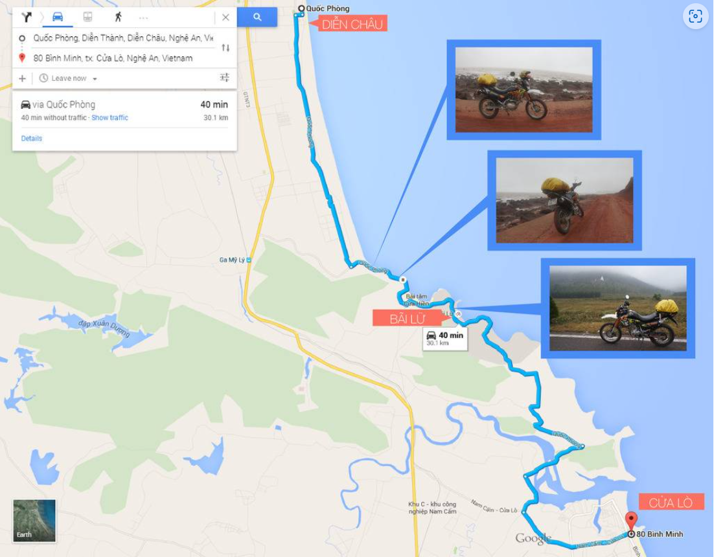
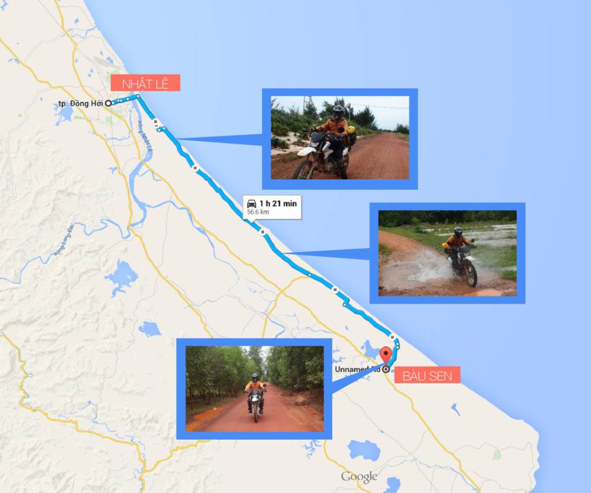
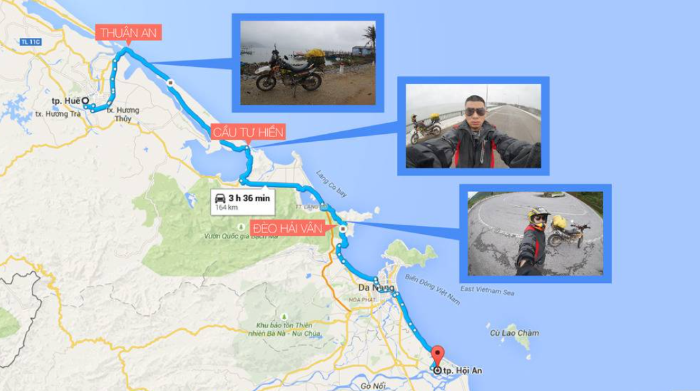
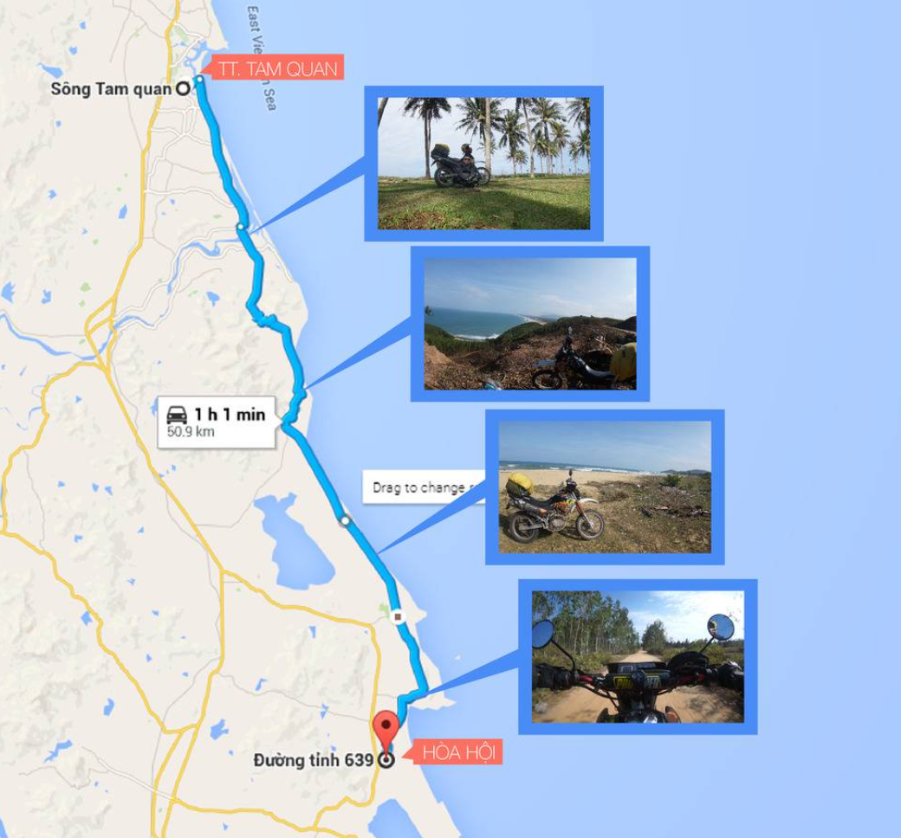
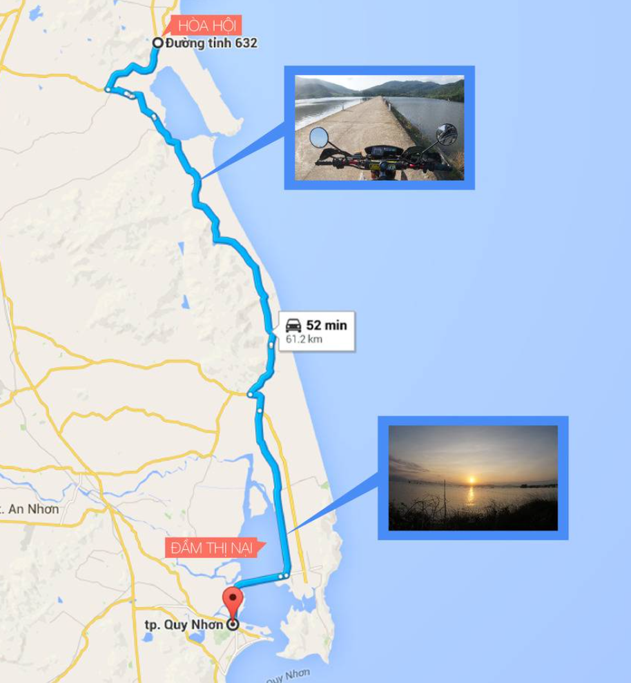
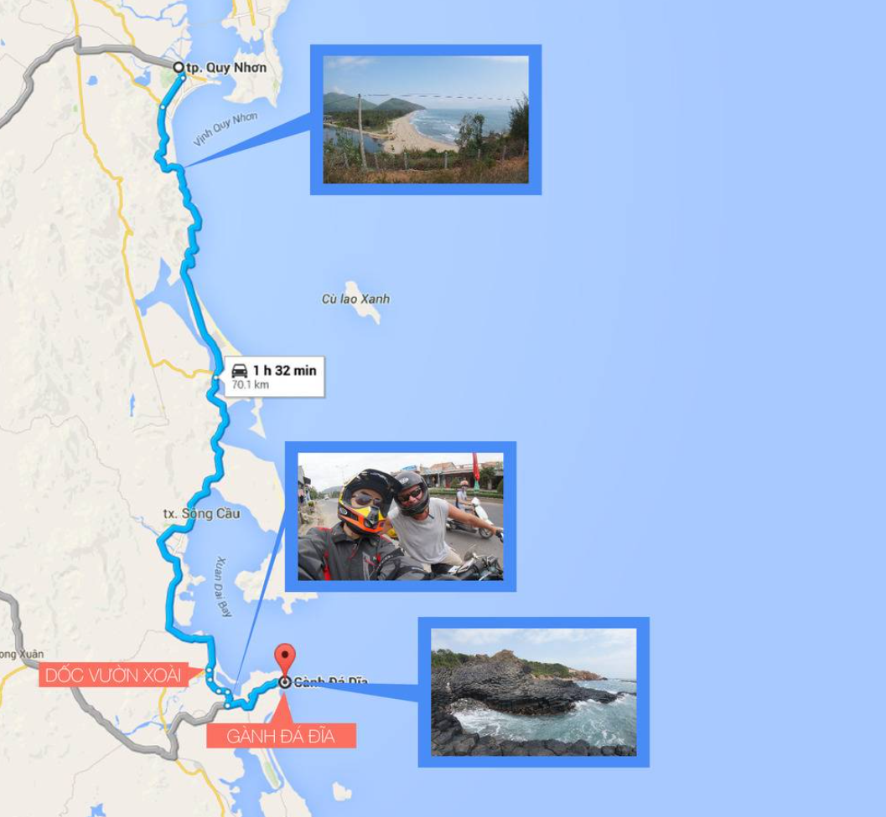
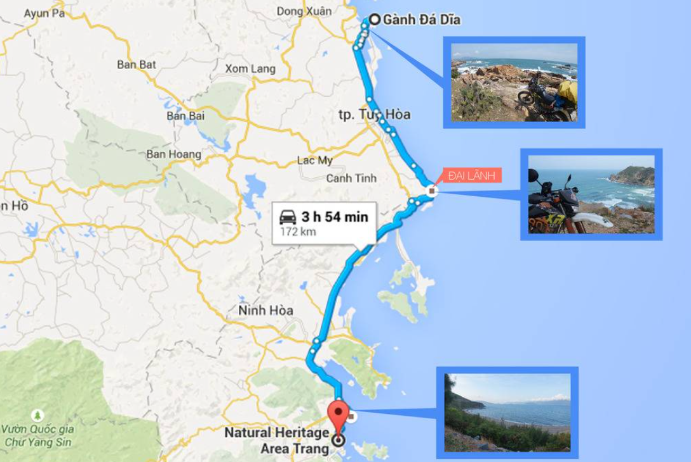
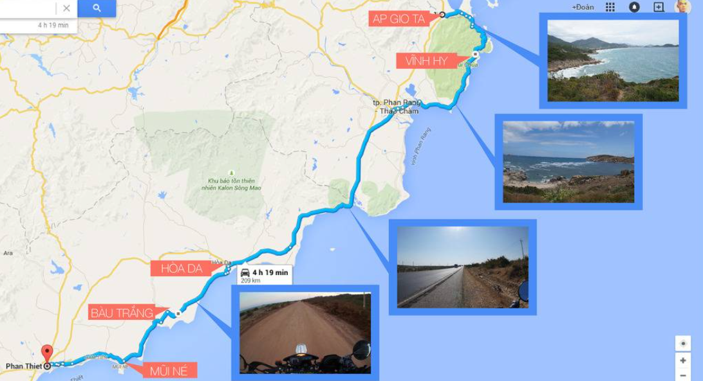
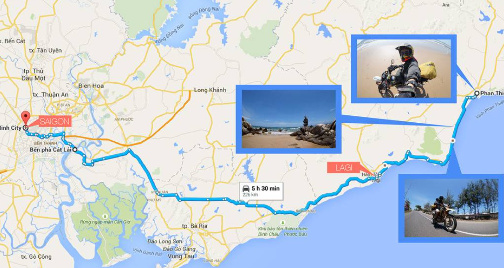

# Bike trip from Ha Noi to Ho Chi Minh city

#### Copied from: https://www.phuot.vn/threads/lich-trinh-kinh-nghiem-xuyen-viet-duong-ven-bien.201121/
#### Note that this itinerary has mostly riding time on the road, to explore the culture and the scenary to the fullest, expect to spend extra days at each stop.

## Day 1: Hanoi - Dien Yen - Dien Thanh - Cua Lo - Vinh (350km)
- This route has almost nothing beautiful or interesting, you should choose the Ho Chi Minh route which is just deserted and avoid sections of National Highway 1 that are being repaired. very dirty and disgusting :v
- From Hanoi, take the HCM road to TX. In Thai Hoa, turn left and go down the road to join National Highway 1 in Dien Yen (Nghe An)
- Go straight on National Highway 1 from Dien Yen to Dien Chau (13km) and turn left onto Dien Thanh beach. There's nothing on this beach, but there is a small road (named Quoc Phong) that runs straight from Dien Thanh to TX. Cua Lo too. When I went on this road, half of it was under construction. There are a few dirt roads close to the coast that are quite interesting.

## Day 2: Vinh – Dong Hoi – Provincial Road 569 – Quang Tri – Hue (400km)
- This leg, according to my assessment, has nothing to do so it's a bit long. At first, before leaving, I just thought of going to Quang Tri and then sleeping (300km), but when I got to Quang Tri, I saw that there was nothing wrong with it, so I tried to go another 100km to Hue and there was still a place to play.
- Note: In Hue there are many places to visit and have fun, you can spend an extra day here to visit, eat and drink. Google for more information about Hue tourism.
- The route for this leg is mainly National Highway 1, just to keep it short.
- There is one stage with a very beautiful red dirt road, one side is white sand dunes, the other side is the sea. In fact, on the last trip, I didn't go in because it was too rainy and I wanted to go quickly to get to Hue, but I had a chance to squeeze in one part. another trip a few years ago. You go from Vinh to City. Dong Hoi (210km) turn to go through Nhat Le bridge onto Vo Nguyen Giap street. At the end of Vo Nguyen Giap street, there will be a small turn on the left to enter provincial road 569. (I went at that time, Vo Nguyen Giap street was under construction so I don't know how it is now. If you can't find it, ask the people) From the beginning Provincial road 569 goes straight (combined with a little detour about 50km, then at the end of the road turns to National Highway 1). Doan turns off to lie in Lien Tien village, Ngu Thuy Nam, Quang Binh. If you go to Provincial Road 569, just ask the people about the dirt road to Le Thuy, Quang Binh. Remember to emphasize that the road is dirt or they will show you the way to National Highway 1A to continue.

## Day 3: Hue - Thuan An - Phuoc Tuong Pass - Hai Van Pass - Da Nang - Hoi An (165km)
- The fun part begins. Normally, people will go on Highway 1 from Hue to Da Nang to Hai Van Pass, so they think it's interesting and fun. But I will show you a part of the road I really like from Hue - Phuoc Tuong Pass - Hai Van Pass - Da Nang
- From the city center. Hue people take the road to Thuan An beach then take the road between Thanh Lam Lagoon, Ha Trung Lagoon and the sea. Just go straight along the small provincial road through the peaceful villages of Hue, past the Tu Hien bridge across the very beautiful and deserted Tu Hien estuary, down the road to the foot of Phuoc Tuong pass (National Highway 1A) and continue up to Hai Van pass. Da Nang as usual.
- I chose to sleep in Hoi An (30km from Da Nang) because I like Hoi An more, Da Nang, Hoi An is a tourist coastal city so there are many places to play, Cu Lao Cham, Son Tra Peninsula, Ba Na Hill, Marble Mountains, etc. If you haven't gone yet, you can plan to stay 1-2 days in Da Nang to experience it.

## Day 4: Hoi An - Tam Quan - Hoa Hoi - Thi Nai Lagoon - Quy Nhon (305km)
- This route is normal in my opinion, but to make it less normal, I found a more fun way to go. :v
- From Hoi An (or Da Nang), you go to TT. Tam Quan along National Highway 1 (191km)
- When you arrive at Tam Quan, turn left to Tam Quan Bac Market, go straight to the beach, then turn right and take the road along the beach straight down provincial road 639 to Hoa Hoi, My Thanh, Binh Dinh. This road has a beautiful pass running along the sea. Near Hoa Hoi, it turns into a bumpy and quite desolate dirt road. It also goes through a cemetery, so I was a bit nervous, but I continued confidently, looking at the ferry map, I would see The small road turns right and curves a bit to get to DT640 road.

- Continue on DT 640 to follow Thi Nai lagoon and go to Thi Nai bridge to enter Quy Nhon. If you can go in time to catch the sunset on Thi Nai Lagoon, it will be great.

- Quy Nhon is a big city that also does relatively good tourism, you can stay for a day to visit, but I have also been to Quy Nhon before and found it quite normal here with some places like egg rock beach. , Cham tower, Han Mac Tu's tomb, you can stop by and say it's ok.

## Day 5: Quy Nhon - Ghenh Da Dia - Tuy Hoa - Dai Lanh - Nha Trang (233km)
- This stage is very interesting, the most interesting is the Dai Lanh beach & lighthouse section, the second most interesting is Ghenh Da Dia.
- If you go from Quy Nhon along Highway 1 to Doc Vuon Xoai, turn left to enter Ganh Da Dia (70km). The road here is relatively small, but just look at the map or signpost or ask people to find Ganh Da Dia. . This is so neat that I don't even have to think about it.
- Near this area there is Mang Lang church, which is quite famous, you can search google or ask people to come visit.

- From Ganh Da Dia, you go along the residential road to National Highway 1. You can ask people if you can go through Phu Thuong Beach and Ganh Yen. If you can, go straight through there and then turn back to National Highway 1. What's more interesting, before I could go, but for some reason, now when I search google maps, it insists on not letting me cross the bridge.
- Go straight along Highway 1 to Tuy Hoa city. You find or ask for directions to Hai Dang Dai Lanh, this is a very beautiful coastal pass that cannot be missed on this journey. In fact, if you have a lot of time, you can arrange to stay in Dai Lanh for 1 night to catch the Dai Lanh sunrise the next day - known as the place to welcome the first sunrise on the mainland of Vietnam. I had the opportunity to enjoy it on another trip and it was truly so peaceful and beautiful. If you stay in Dai Lanh, you can arrange time to visit some spots around the city. Tuy Hoa, if you search google, there are many articles about Tuy Hoa tourism.
- If you don't stay at Dai Lanh, after visiting Dai Lanh lighthouse, continue on the road through Vung Ro, rejoin National Highway 1, cross Deo Ca to enter Nha Trang. Near Nha Trang, there is a short stretch of sea called Pham Van Dong is also quite beautiful and cool, so you should turn around before entering the city.

- Nha Trang is a very interesting and beautiful tourist city. You can arrange to stay 1-2 days to have more fun, or go to Binh Ba Island, Yen Island to play for a few days to make it happy and then return to Nha Trang. keep going ) For tourism information in Nha Trang, search for Mr. Gu Go. Much.

## Day 6: Nha Trang - Cam Ranh - Vinh Hy - Phan Rang - Hoa Da - Bau Trang - Mui Ne - Phan Thiet (274km)
- This is my personal trip Rated as the most beautiful of all the coastal roads in Vietnam I have traveled.
- From Nha Trang city, you go along the beach, around the side of Cam Ranh airport to go to National Highway 1A (this road is also quite beautiful).
- Go straight on National Highway 1A, pass Cam Ranh a little and there is a place named Ap Gio Ta (?! Google maps says that), turn left to enter the coastal road leading to Binh Tien beach & Vinh Hy Bay. This is my favorite part of the whole trip, the sea is beautiful, the mountain pass is very winding, and especially extremely deserted, there is a part going through all the cacti, it feels like going through a very happy desert: v
- At the end of the Vinh Hy and Binh Tien detour, it will be Phan Rang city. You go through the city straight to Highway 1 to Phan Ri, then stop to ask for the dirt road to Bau Trang. This is an extremely fun road going through the endless hills of Binh Thuan. The day I went, I was a little over time, so driving like crazy on this road felt like I was racing Dakar ). At the end of this dirt road will be Bau Trang - a very famous tourist destination of Binh Thuan. You can play sand skiing on 4-wheeled terrain vehicles (ATVs) here.
- Bau Trang is about 26km from Mui Ne. In my opinion, you should invest a little to rent a resort to stay here for 1 day because Phan Thiet - Mui Ne is a place with great beaches and resort services at very reasonable prices.

## Day 7: Phan Thiet - La Gi - Vung Tau - SG (end of journey) (250km)
- The Phan Thiet - La Gi sea route is super wonderful, I stayed in SG for about 9 months and came back here 3 times to enjoy it because it's so beautiful (every road will praise you )
- From Phan Thiet, find your way along the sea to Lagi on this section, you should visit Ke Ga Cape and Ke Ga lighthouse, the scenery is very beautiful :x
- Coming to Lagi, you can choose to go straight to SG or go around Vung Tau to visit a bit. Actually, my feeling about Vung Tau is normal, a bit better than Do Son but here there are pancakes & cotton cakes. The salted egg orchid is very delicious, you can stop by and try it )
- From Vung Tau to SG, there is nothing fun anymore, I remind you to pay attention to your speed and do it on this road, the police will do it. It's very tight ) You should find a way to go through Cat Lai ferry to get to SG so it's close 

- When you come here, it's up to you to continue your journey, you can stay 1-2 days to see what Saigon is like (actually it's fun but there's nothing like tourism), you can continue down to the West, Ca Mau. Quickly let it go, you can go diagonally all the way to Phu Quoc island, or turn around and go to Da Lat, Central Highlands, Ho Chi Minh road to Hanoi. I have already gone to these places, so if you want to ask for more information, please inbox me. Or I will share in the following articles if I have time.
