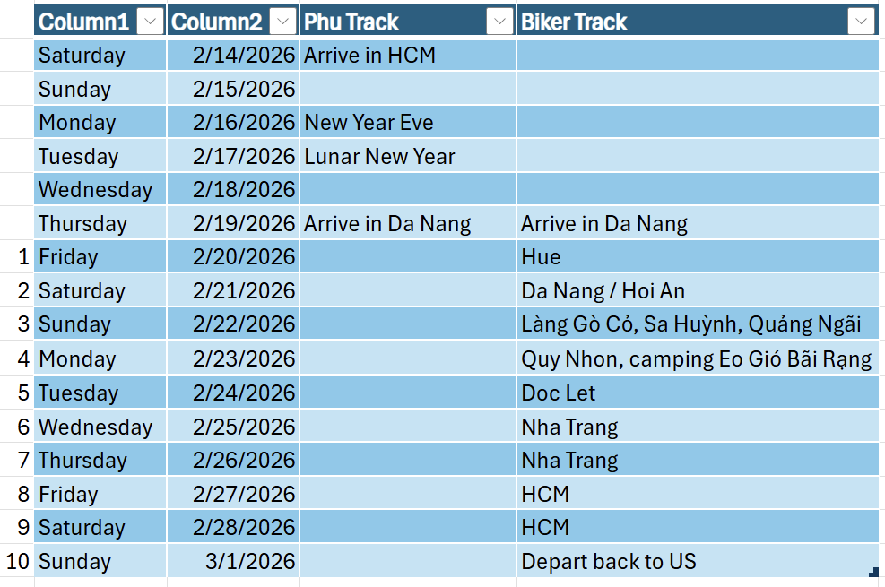

# Hue - Ho Chi Minh Bike Trip

### This trip highlights the best coast line of Vietnam featuring the best beaches. It starts with Hue, the old capital of Vietnam, and ends with Nha Trang.

Proposed timeline for 2026

Cost: 2k-3k (10-14 days)
* Round-trip US-Vietnam: 1k
* Daily
  * Hotel: $40
  * Food: $40
  * Bike rental: $10

## Day 1: Hue
Hue is just a short 2-hours drive from Da Nang.
* Imperial City
* Imperial dinner
<iframe width="560" height="315" src="https://www.youtube.com/embed/ux_--ni9r8Q?si=f3ZE0zmB8bGBz6RW" title="YouTube video player" frameborder="0" allow="accelerometer; autoplay; clipboard-write; encrypted-media; gyroscope; picture-in-picture; web-share" referrerpolicy="strict-origin-when-cross-origin" allowfullscreen></iframe>

## Day 2: Da Nang / Hoi An
* Snorkel in Da Nang
* Ancient town
* Ancient boat
* Culture show

<iframe width="560" height="315" src="https://www.youtube.com/embed/ZWj54JtkiSw?si=nMqnLXuy21Rvzjji" title="YouTube video player" frameborder="0" allow="accelerometer; autoplay; clipboard-write; encrypted-media; gyroscope; picture-in-picture; web-share" referrerpolicy="strict-origin-when-cross-origin" allowfullscreen></iframe>

<iframe width="560" height="315" src="https://www.youtube.com/embed/fBLF-kFihPs?si=bgF-NQmXQpPl0wH6" title="YouTube video player" frameborder="0" allow="accelerometer; autoplay; clipboard-write; encrypted-media; gyroscope; picture-in-picture; web-share" referrerpolicy="strict-origin-when-cross-origin" allowfullscreen></iframe>

## Day 3: Quang Ngai - LangGoCo
Sleep in Lang Go Co https://langgoco.com/danh-muc/homestay/
<iframe width="560" height="315" src="https://www.youtube.com/embed/MwmjRjDNt3Q?si=swM_G6FrdDK4HhAe" title="YouTube video player" frameborder="0" allow="accelerometer; autoplay; clipboard-write; encrypted-media; gyroscope; picture-in-picture; web-share" referrerpolicy="strict-origin-when-cross-origin" allowfullscreen></iframe>

## Day 4: Quy Nhon - Ky Co Eo Gio
Camping at Bai Rang, Ky Co Eo Gio
https://youtube.com/shorts/qexF_ZohiAo?si=H6zVm10PkkeFB-ru
<iframe width="560" height="315" src="https://www.youtube.com/embed/RpXeCw2ojM4?si=YYDSecI8m5gURDht" title="YouTube video player" frameborder="0" allow="accelerometer; autoplay; clipboard-write; encrypted-media; gyroscope; picture-in-picture; web-share" referrerpolicy="strict-origin-when-cross-origin" allowfullscreen></iframe>

## Day 5: Doc Let
We will mostly glamping-camping at the beach
<iframe width="560" height="315" src="https://www.youtube.com/embed/ah-4iB3vxxw?si=ohTO4s7dxqsdkFP8" title="YouTube video player" frameborder="0" allow="accelerometer; autoplay; clipboard-write; encrypted-media; gyroscope; picture-in-picture; web-share" referrerpolicy="strict-origin-when-cross-origin" allowfullscreen></iframe>

## Day 6: Nha Trang mainland

<iframe width="560" height="315" src="https://www.youtube.com/embed/K1APiW5JK7s?si=HXkXg7Pt3m5Ih968" title="YouTube video player" frameborder="0" allow="accelerometer; autoplay; clipboard-write; encrypted-media; gyroscope; picture-in-picture; web-share" referrerpolicy="strict-origin-when-cross-origin" allowfullscreen></iframe>

## Day 7: Nha Trang islands
* Boat to islands
* Lunch on floating restaurants

## Day 8: Fly to HCM
## Day 9: HCM
## Day 10: Departing to US at 3pm, arriving Seattle at 6pm.

