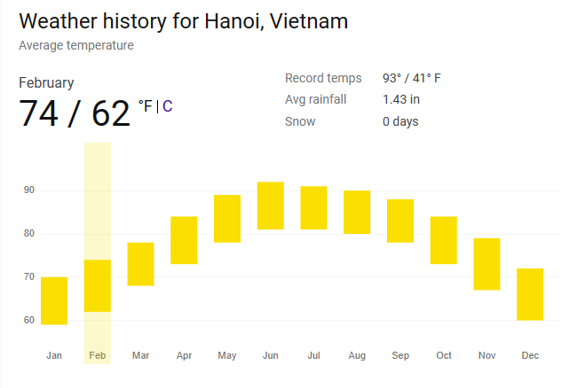
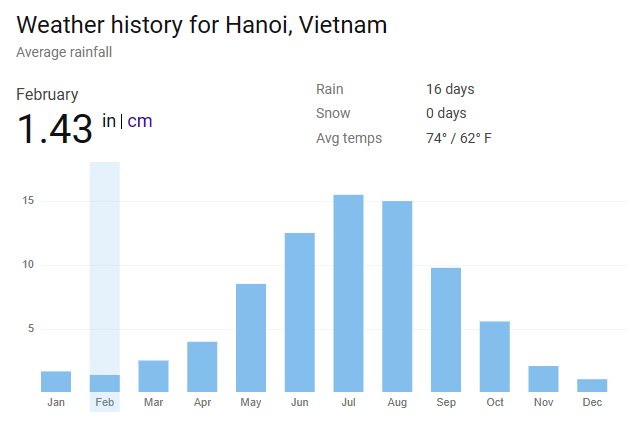
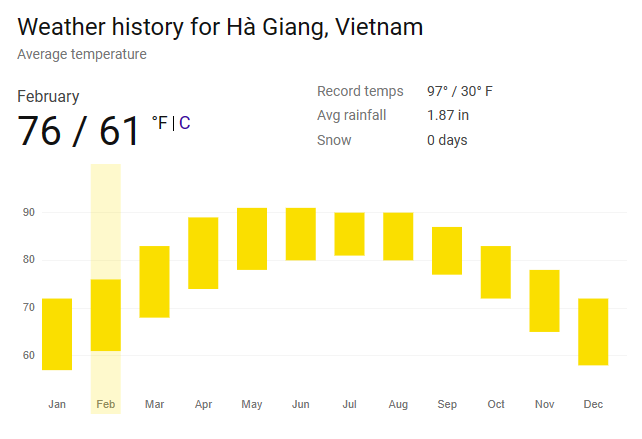
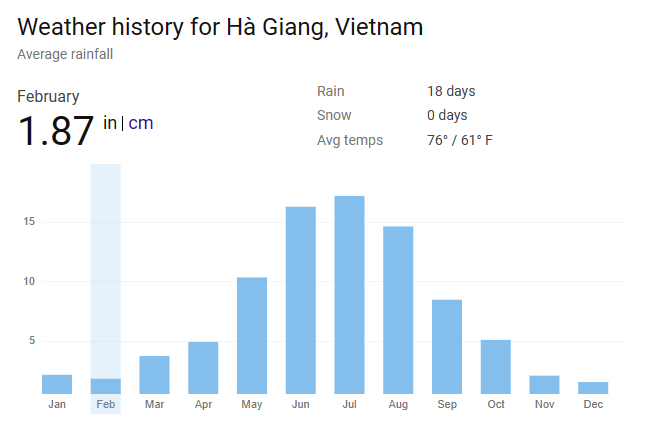
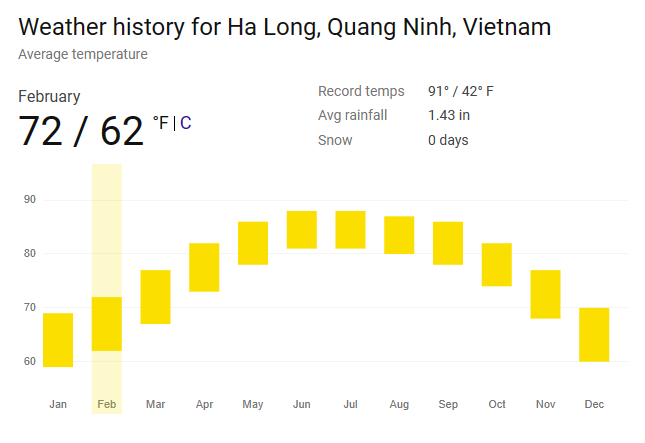
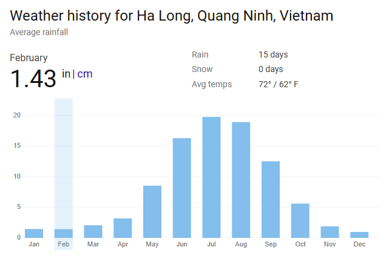
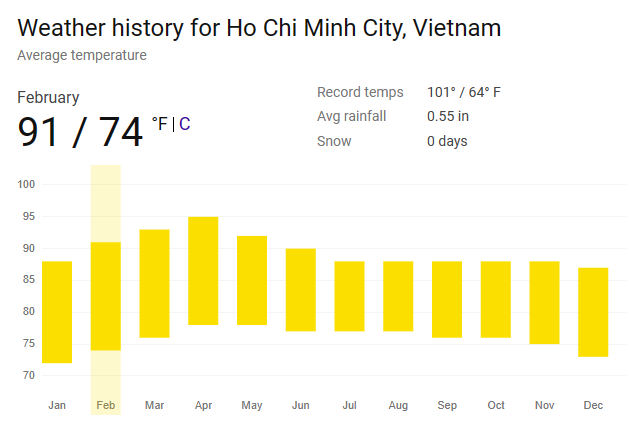
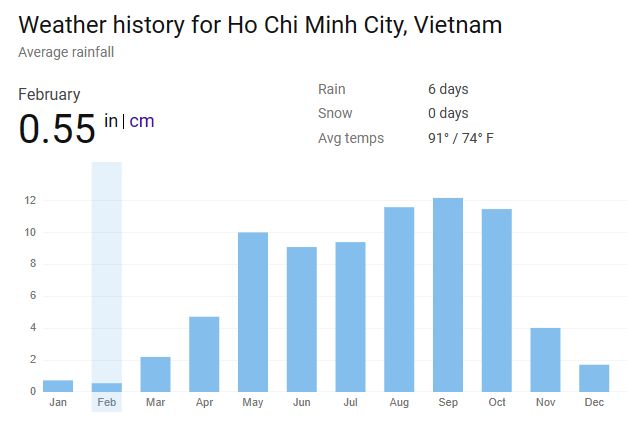
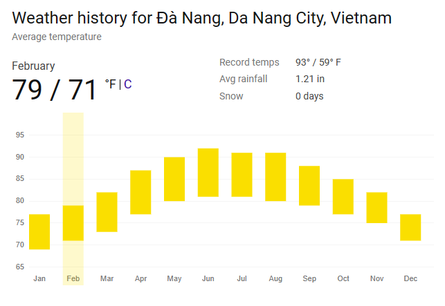
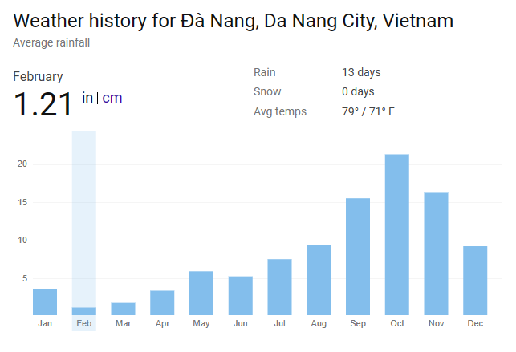

* [Bike trip in Northern Vietnam](HaGiang-HaLong.md)
* [Bike trip Hue - Ho Chi Minh](Hue-HoChiMinh.md)
* [Bike trip Ha Noi - HCM](HaNoi-HCM.md)
* [Explore world's biggest caves in Phong Nha](Caving-PhongNha.md)

## Best time to travel
### February
* Spring time for the north, blooming flowers
* Lowest risk of rain

### September
* Beautiful yellow rice field, harvest season
* Rainy season
* End of summer heat throughout Vietnam

| Temperature | Rain |
|-------------|------|
|||
|||
|||
|||
|||
